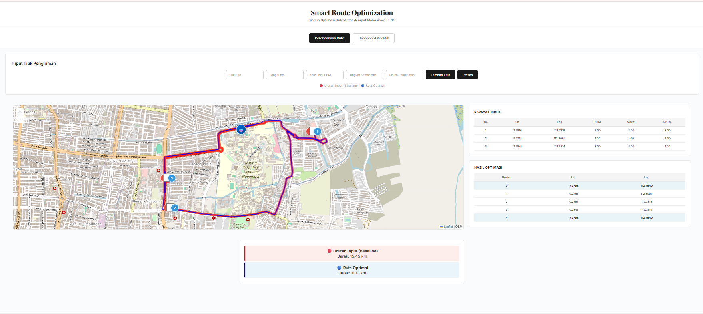

# Smart Route Optimization System

Sistem optimasi rute berbasis Flask, Leaflet, dan OR-Tools untuk layanan antar-jemput mahasiswa PENS.

## Features

* Interactive map visualization
* Route optimization using OR-Tools
* Multi-factor optimization:

  * Distance
  * Fuel consumption
  * Traffic congestion
  * Delivery risk
* Real-time route simulation

## Technologies

* Python Flask
* JavaScript
* Leaflet.js
* OpenRouteService API
* OR-Tools

## Installation

```bash
pip install pandas
```

## Run Project

```bash
python app.py
```

Open browser:

```plaintext
http://127.0.0.1:5000
```
## Preview

